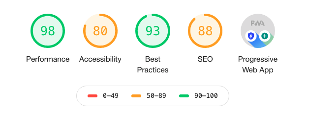
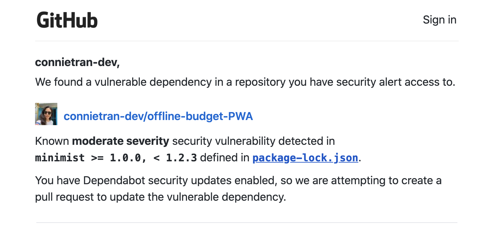

# IndexBudget Tracker: Progressive Web App

## Web optimization with IndexedDB & Webpack

We were tasked with adding offline access and functionality to a Budget Tracker application. In addition to providing offline capabilities to the application with IndexedDB, I used this project as an opportunity to practice web optimization techniques, including:

* File compression
* Code minification
* JS bundling
* JS transpiling
* Client-side caching
* And creation of progressive web apps

(See technologies below.)

In this application, you are able to add expenses and deposits to your budget with or without a connection. When entering transactions when the app is offline, the transactions will populate the total when the application is brought back online.

The application is deployed to Heroku and can be installed as a progressive web app through your browser here: [IndexBudget.herokuapp.com](https://indexbudget.herokuapp.com)

This application is built with the following technologies:

* **IndexedDB:** Offline transaction storage
* **webpack:** Module bundling and minification
* **wepback-pwa-manifest:** Webpack plug-in for generating manfiest.json for PWAs (npm package)
* **babel-loader:** Javascript transcompiler to convert ES6 JS into backwards compatible JS (npm package)
* **compression:** Compression for middleware responses (npm package)
* **MongoDB:** Persistent database storage
* **Mongoose:** ODM modeling
* **Express:** Middleware routing
* **NodeJS:** Javascript runtime environment
* **Heroku:** Hosting

With these optimization techniques, the final Lighthouse results for the hosted application turned out as follows with all the benefits of a progressive web app:

## Technologies

### **IndexedDB**

While the user is online, any withdrawal or deposit transactions are stored in the MongoDB backend which was defined with Mongoose.

In order to provide offline capabilities, this application utilizes [IndexedDB](https://developer.mozilla.org/en-US/docs/Web/API/IndexedDB_API) for client-side storage by:

* Opening a database
* Creating an object store named `pending` in the IndexedDB. ([`db.js`](https://github.com/connietran-dev/offline-budget-PWA/blob/main/public/db.js))

If the application is unable to create the withdrawal or deposit transaction in the MongoDB backend, it will make a request to IndexedDB to store the transaction data in the `pending` object store. When the application comes back online, the data in IndexedDB is written to MongoDB to be rendered in the UI again.

### **Progressive Web App**

In addition to adding offline functionality to the application, I also made the application a progressive web app by:

*  Adding a web app `manifest.webmanifest` to install the app on the user's device, and 
* Registering a `servicer-worker.js` to the project that runs on a separate thread than the main JS code of the application to cache site assets and make them available when the user's device is offline.

I initially created the web app manifest manually. However, I eventually utilized the npm package [`webpack-pwa-manifest`](https://www.npmjs.com/package/webpack-pwa-manifest), a webpack plug-in that generates a `manifest.json` for the PWA.

## **Webpack & Babel**

I used Webpack to bundle & minify my JS files and Webpack Dev Server for hot reloading during development. I also utilized several Babel npm packages, including [`babel-loader`](https://www.npmjs.com/package/babel-loader) which uses Babel and webpack to transpile my JS files to older JS that is compatible with older browsers. The article written [here](https://medium.com/front-end-weekly/what-are-npm-yarn-babel-and-webpack-and-how-to-properly-use-them-d835a758f987) helped me tremendously with installing Babel into my project.

## Takeaways

Throughout developing this app, I ran into quite a few interesting "got-chas" and thankfully got help from some friends along the way:

**Updating cached files in your service worker**

I first developed the base app files, then added webpack to bundle my JS files. This introduced some errors in the browser console - it turned out I needed to make sure to update my `service-worker.js` to cache the correct files in the `dist/` bundle that is output by webpack.

**Refactor JS files for webpack bundling**

In order for webpack to bundle your JS, you can export all of your modules into one file (in my case, `index.js`) for that file to be bundled. I had to refactor my `index.js` to utilize functions from `db.js` and move any eventListeners into my index file.

**Minimist package security vulnerability**

I committed my package-lock.json file to GitHub and got an email notifying me that there was a security vulnerability in the version of `minimist` that came installed with `webpack`.

Thankfully, I found an extremely useful article with an easy fix. This also helped me learn about additional options available with npm's package.json, such as `npm-force-resolutions`:

https://itnext.io/fixing-security-vulnerabilities-in-npm-dependencies-in-less-than-3-mins-a53af735261d

**Deploying Webpack to Heroku**

Trying to deploy the application to Heroku turned out to be very tricky. I kept getting errors until I got some help from my very experienced instructor. You can see what I ran into with some of my commits.

First, the starter files that were provided had hard-coded the PORT and MongoDB URI. In order to make it work for production, I added in several `process.env` arguments in server.js. Through this process, I learned to ensure that my application is generic for production for PORTs and database connections. I also learned how to test my application in a more production-like environment by:

* Declaring your Node version in your package.json to match the version of Node that will be used in production,
* Passing things like `ENV=production npm start` while developing locally to mimic your production configurations, and 
* Running `heroku local web` through the Heroku CLI to build your app and run it locally. 

I've also learned that each hosting platform has its own way of deploying Node applications. Some Heroku resources that helped me are [here](https://devcenter.heroku.com/articles/deploying-nodejs) and [here](https://devcenter.heroku.com/articles/getting-started-with-nodejs).

Second, I learned *when* webpack is run for production applications. Although I've committed my webpack output `dist/` folder to GitHub, webpack bundling is only run at build time when deploying to Heroku. Heroku (and other hosting platforms) do so by running your npm `scripts` in your package.json. [Heroku](https://devcenter.heroku.com/changelog-items/1557), specifically, will run any `build` scripts in your package.json. My Heroku build kept failing because I had `"build": "webpack --watch"` for my build script.

Third, I got an email from Heroku notifying me that the mLabs MongoDB add-on for Heroku would be discontinued. My next step and future enhancement is to migrate to `MongoDB Atlas`.

In the end, I learned a ton through the struggle :) I will continue applying these optimization techniques, and I know "going slow to go fast" in the beginning with this "practice round" will help me avoid these speed bumps in future projects, especially around local development versus production deployment.

## App Functionality

### User Story

AS AN avid traveller  
I WANT to be able to track my withdrawals and deposits with or without a data/internet connection  
SO THAT my account balance is accurate when I am traveling

Offline Functionality:

  * Enter deposits offline
  * Enter expenses offline

When brought back online:

  * Offline entries should be added to tracker.

### Business Context

Giving users a fast and easy way to track their money is important, but allowing them to access that information anytime is even more important. Having offline functionality is paramount to our application's success.

### Acceptance Criteria

GIVEN a user is on Budget App without an internet connection  
WHEN the user inputs a withdrawal or deposit  
THEN that will be shown on the page, and added to their transaction history when their connection is back online.